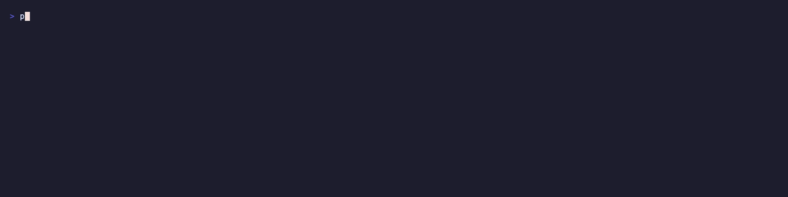

<p align="center">
  
  <h1 align="center">peek</h1>
  <p align="center">Describe images and videos from the terminal using vision LLMs</p>
</p>

<p align="center">
  <a href="https://github.com/Aayush9029/peek/releases/latest"></a>
  <a href="https://github.com/Aayush9029/peek/blob/main/LICENSE"></a>
</p>

<p align="center">
  
</p>

## Install

```bash
brew install aayush9029/tap/peek
```

Or tap first:

```bash
brew tap aayush9029/tap
brew install peek
```

Requires `OPENROUTER_API_KEY` ([get one](https://openrouter.ai/keys)).
Video support requires `ffmpeg` (`brew install ffmpeg`).

## Usage

```bash
peek photo.png                          # describe an image
peek clip.mp4                           # describe a video
peek demo.mov --frames 10              # video with 10 frames
peek shot.png -m qwen72b -d detailed    # larger model, detailed description
peek ui.png -c "iOS settings screen"    # with context hint
peek image.png --name-only              # just the name
peek --list-models                      # list available models

# directory mode (images + videos)
peek ./screenshots                      # describe all files in dir
peek ./screenshots --rename             # describe + rename files
peek ./media -r -j 4                   # parallel recursive
```

Piped output is tab-separated (`name\tdescription`).

## License

MIT
